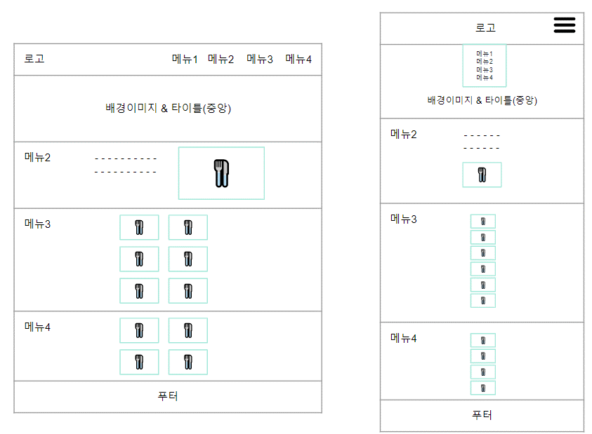
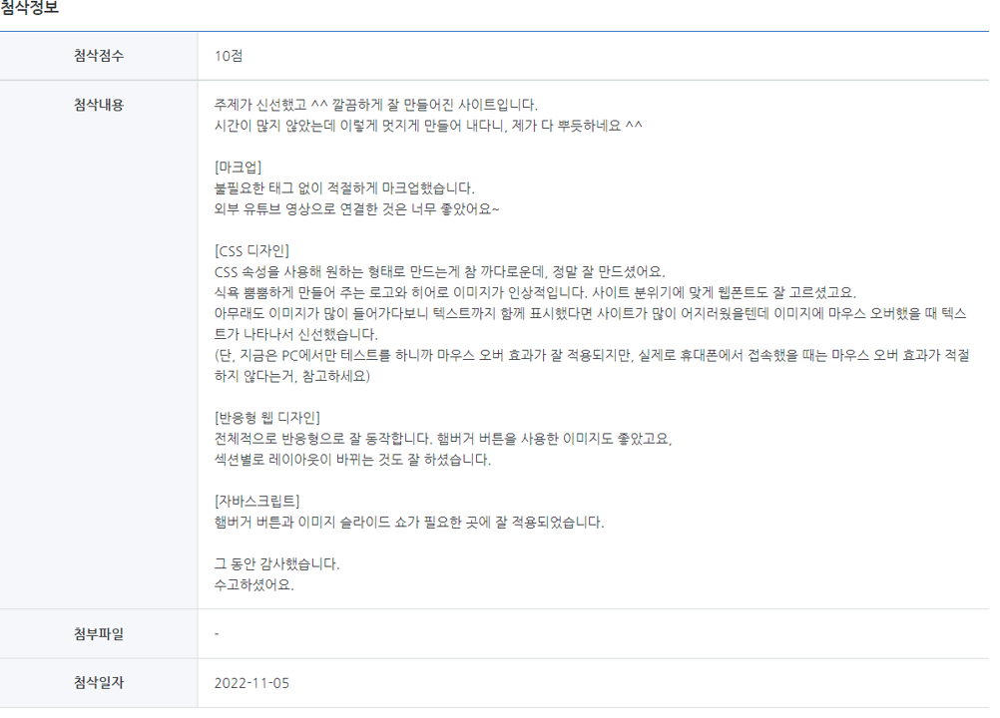

<div width="100%" height="100%" align="center">
  
<h1 align="center">
  <p align="center">🍜 반응형 웹사이트 프로젝트 </p>
  <a href="jeehay28.github.io/4-dollar-meals/">
    
  </a>
 </h1>
</div>

<br>
<br>

## 💡 Introduction

- **개발 기간**
  > 2022.10.31. ~ 2022.11.04.

- **개발 환경**

  > HTML, CSS, JavaScript

- **웹사이트 구조**
  > 1 page 사이트 (한 화면에서 앵커로 이동하는 사이트) 반응형 웹으로 동작

  > 자바스크립트를 사용한 동적인 효과가 2개 이상 포함

- **기대효과**
  > 고물가 시대에 4달라로 한끼 해결할 수 있는 꿀조합 정보 소개

- **팀명**
  > 한끼 4 $ ("한끼 사달라!")

- **팀원(4명)**
  > 김도연, 박지혜, 이건영, 조성윤 

- **담당자별 역할**
  > 메인페이지 (박지혜) : 히어로 이미지, 로고, 햄버거 버튼

  > 소개글(조성윤) : 사진, 설명, 캐러셀

  > 라면조합(이건영) : 사진, 설명, 조리법, 마우스오버 효과

  > 꿀조합 & 푸터(김도연) : 사진, 설명, 조리법, 마우스오버 효과


<br> 
<br> 

## 🎨 Development

- **레이아웃**
  > 

- **섹션별 ID**
``` 
  <a href="#">홈</a>
  <a href="#desc">소개글</a>
  <a href="#ramen">라면조합</a
  <a href="#combi">꿀조합</a>
```

- **섹션별 구성 예시**
```
<!-- 섹션1: 메뉴 --> 
<div id="navbar">
<!-- 소개글 -->
<div id="desc">
<!-- 라면 조합 모음 -->
<div id="ramen">
<!-- 꿀조합 & footer -->
<div id="combi">
```

- **폰트**
  > 구글 폰트 : https://fonts.google.com/?subset=korean

  > gamja flower, poor story

- **컬러**
  > 전체적인 컬러: 검은색, 흰색, 노란색, 빨간색

  > 글자 색은 되도록 검정 또는 흰색을 사용하고 효과 적용 시에만 노란색 또는 빨간색 사용


<br> 
<br> 

## ✅ Completion
- **메인 페이지**
  > 로고 및 배경이미지 컨셉 : 저렴한 가격으로 맛있게 조리해서 먹었을 때 생기는 ‘스마일’
  
  > 상단 메뉴바 : 고정, 클릭시 해당 메뉴로 이동
  
  > 로고 마우스오버 : 로고 움직임 (애니메이션 효과)
  
  > 메뉴 마우스오버 : 밑줄 표시
  
  > 중단점(768px)이하의 브라우저에서는 햄버거 버튼 생성되고 가로 메뉴 사라짐
  
  > -  햄버거 버튼 클릭하면 메뉴가 중앙 나타나고 클릭하거나 스크롤하면 사라짐 
  
  > 파비콘 적용
  
  > 메뉴 클릭 시 스무스하게 화면 이동

- **소개글**
  > 사이트 소개글 문구 작성
  
  > JavaScript로 이미지 슬라이드 구현
  
  > 중단점(768px) 이하 설명글과 이미지 슬라이드를 세로로 정렬 및 이미지 비율 조정

- **라면 조합**
  > 섹션 설명 텍스트를 통해  간략한 소개

  > 메뉴 사진이 마우스 오버시 조리된 사진으로 교체됨

  > 투명도 조절을 통해 조리된 사진에 가격, 제조법 링크 제공

  > 폰트사이즈와 menu 설명란(가격,제조법 링크) 최적화

  > 중단점(768px) 이하 레이아웃 변경

- **꿀조합**
  > 꿀조합 섹션 및 푸터, Top 버튼

  > 사진 위에 마우스를 올리면 색이 바뀌면서 음식의 이름과 설명이 보임

  > sns  아이콘 추가

  > 마우스오버 색상 변화

  > 중단점(768px) 이하 레이아웃 변경


<br> 
<br> 

## 👏 Evaluation
- 팀원 간 평가의견
  > 팀원 간에 충분히 웹사이트 구성에 대해 논의를 하고 규칙을 정한 것이 작업하는 데 시간을 단축해 주고 소스를 취합했을 때 매끄럽게 잘 연결되었음
  
  > 중단점 (768px)을 한 개 설정했는데 2개 이상 적용하면 더욱 동적으로 반응하는 웹사이트를 만들 수 있으리라 생각됨
  
  > 과정이 진행될 때 중간 점검을 통해 진행 상황을 공유하고 서로 간의 피드백을 통해 비교적 결과물이 깔끔하게 나왔음
  
  > 실습자료를 참고하지 않으면 스스로 코딩하는 것이 너무 어려웠음
  
  > 이론/실습수업에서 배운 예제들을 활용하여 실제로 웹사이트를 처음부터 끝까지 완성해보니 생각보다 많은 점을 고려해야 하는 점이 어려웠음
  
  > 기존 pc 버전뿐만 아니라 중단점 버전 미디어쿼리를 설정해 작업하면서 어떻게 해야 퀄리티 있는 반응형 페이지를 만들 수 있는지 여러모로 생각해보게 되었음

- 고경희 지도강사 평가의견
  > 8년 연속 웹 분야 1위 도서인 "Do it HTML+CSS+자바스크립트 웹 표준의 정석"을 비롯해 지금까지 40여 종의 책을 집필한 저자

  > 
